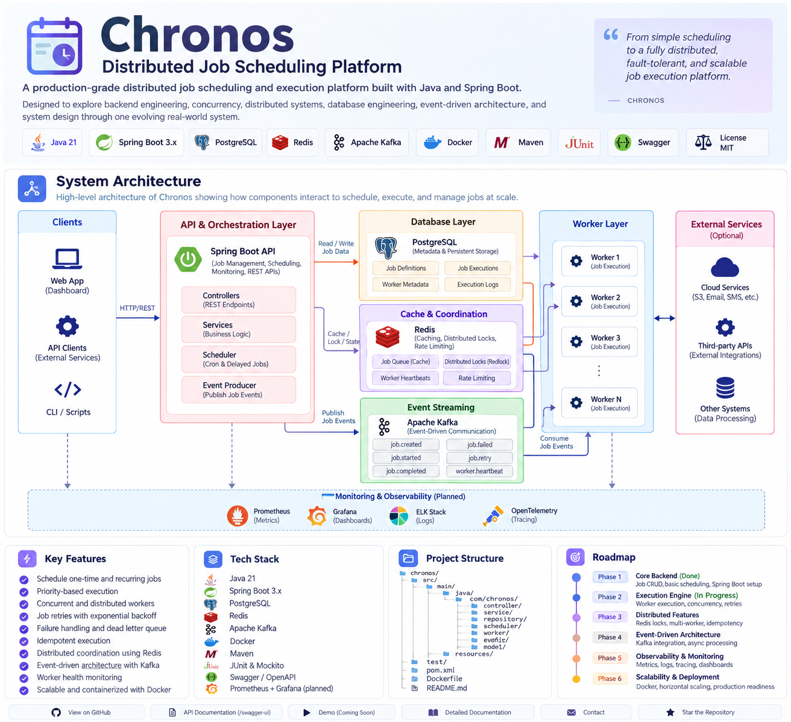

<div align="center">

# ⚙️ Chronos

### Distributed Job Scheduling & Execution Platform

**A backend engineering project exploring reliable scheduling, concurrent execution, fault tolerance, and distributed systems with Java and Spring Boot.**

<p>
  
  
  
  
  
  
  
</p>

> **Understand the problem → understand the trade-off → choose the technology → implement it → test it → measure it.**

</div>

---

## 📌 Project Status

> 🚧 **Actively under development**

Chronos is being built incrementally. The repository currently starts from a Spring Boot backend foundation and evolves toward a distributed scheduling system.

The README deliberately distinguishes between **implemented foundations**, **work in progress**, and **target architecture** so that the project does not claim production capabilities before they are actually implemented.

---

## 🚀 What is Chronos?

Chronos is a distributed job scheduling and execution platform designed around a simple problem:

> **How do you reliably schedule work, execute it concurrently, recover from failures, and eventually scale execution across multiple machines?**

Instead of stopping at a conventional:

```text
Controller → Service → Repository → Database
```

Chronos uses the project as a practical way to study and implement:

- Job scheduling and lifecycle management
- Priority-based execution
- Concurrent worker pools
- Retries and exponential backoff
- Idempotent execution
- Database transactions and indexing
- Redis-based coordination and caching
- Kafka-based asynchronous execution
- Worker health and failure detection
- Distributed scheduler coordination
- Horizontal scaling
- Observability and production engineering

---

# 🏗️ Architecture

## Architecture at a Glance

The intended evolution is:

```text
                    ┌─────────────────────┐
                    │       Client        │
                    │ Web / API / CLI     │
                    └──────────┬──────────┘
                               │
                               ▼
                    ┌─────────────────────┐
                    │  Spring Boot API    │
                    │ Controllers         │
                    │ Services            │
                    │ Validation          │
                    └──────────┬──────────┘
                               │
                ┌──────────────┼───────────────┐
                │              │               │
                ▼              ▼               ▼
        ┌──────────────┐ ┌──────────────┐ ┌──────────────┐
        │ PostgreSQL   │ │    Redis     │ │    Kafka     │
        │              │ │              │ │              │
        │ Job state    │ │ Cache        │ │ Job events   │
        │ Executions   │ │ Locks        │ │ Async queue  │
        │ Metadata     │ │ Coordination │ │ Retry/DLQ    │
        └──────────────┘ └──────┬───────┘ └──────┬───────┘
                                │                 │
                                └────────┬────────┘
                                         ▼
                              ┌────────────────────┐
                              │ Scheduler /        │
                              │ Dispatch Layer     │
                              └─────────┬──────────┘
                                        │
                         ┌──────────────┼──────────────┐
                         ▼              ▼              ▼
                    ┌─────────┐   ┌─────────┐   ┌─────────┐
                    │Worker 1 │   │Worker 2 │   │Worker N │
                    └────┬────┘   └────┬────┘   └────┬────┘
                         │             │             │
                         └─────────────┼─────────────┘
                                       ▼
                              ┌──────────────────┐
                              │  Job Execution   │
                              └────────┬─────────┘
                                       │
                         ┌─────────────┴─────────────┐
                         ▼                           ▼
                    ┌──────────┐               ┌──────────┐
                    │ Success  │               │ Failure  │
                    └────┬─────┘               └────┬─────┘
                         │                            │
                         ▼                            ▼
                   Completed                    Retry / Backoff
                                                      │
                                      ┌───────────────┴───────────────┐
                                      ▼                               ▼
                                  Re-queue                         DLQ
```

### Architecture image

The repository also contains a visual architecture overview:



---

## 🧭 Current vs Target Architecture

### Current foundation

Chronos begins intentionally as a modular Spring Boot application:

```text
Client
  │
  ▼
REST Controller
  │
  ▼
Service Layer
  │
  ▼
Repository Layer
  │
  ▼
PostgreSQL
```

This stage establishes:

- REST API design
- DTOs and validation
- Service/repository separation
- Persistence
- Transactions
- Error handling
- Clean domain boundaries

### Target distributed architecture

As real engineering problems appear, the system evolves toward:

```text
                         Load Balancer
                              │
               ┌──────────────┼──────────────┐
               ▼              ▼              ▼
            API-1           API-2           API-N
               │              │              │
               └──────────────┼──────────────┘
                              │
             ┌────────────────┼────────────────┐
             ▼                ▼                ▼
        PostgreSQL          Redis             Kafka
             │                │                │
             │                │                ▼
             │                │          Job Events / Queue
             │                │                │
             │                └──────► Scheduler
             │                             │
             │                             ▼
             │                      Worker Pool
             │                    ┌────┬────┬────┐
             │                    ▼    ▼    ▼    ▼
             │                   W1   W2   W3   WN
             │                    │    │    │    │
             └────────────────────┴────┴────┴────┘
                                      │
                                      ▼
                                Job Execution
                                      │
                           ┌──────────┴──────────┐
                           ▼                     ▼
                       COMPLETED              FAILED
                                                 │
                                                 ▼
                                              RETRY
                                                 │
                                      ┌──────────┴──────────┐
                                      ▼                     ▼
                                   Requeue                  DLQ
```

This separation makes the scaling model explicit:

- **API instances** scale request handling.
- **Schedulers** coordinate due jobs.
- **Kafka** decouples scheduling from execution.
- **Workers** scale execution capacity.
- **PostgreSQL** remains the durable source of job state.
- **Redis** handles fast coordination, caching, and distributed primitives.

---

# 🔄 Job Lifecycle

Every job follows a controlled state machine:

```text
                    ┌───────────┐
                    │  CREATED  │
                    └─────┬─────┘
                          ▼
                    ┌───────────┐
                    │ SCHEDULED │
                    └─────┬─────┘
                          ▼
                    ┌───────────┐
                    │  QUEUED   │
                    └─────┬─────┘
                          ▼
                    ┌───────────┐
                    │  RUNNING  │
                    └─────┬─────┘
                    ┌─────┴──────┐
                    ▼            ▼
               COMPLETED      FAILED
                                 │
                                 ▼
                              RETRYING
                                 │
                                 ├──────────► RUNNING
                                 │
                                 ▼
                            DEAD_LETTER
```

The state model makes execution history explicit and provides a foundation for retries, monitoring, idempotency, and recovery.

---

# ⚙️ Core Design

## 1. Job Management

Chronos models a job as durable scheduling state rather than simply a database row.

Planned responsibilities include:

- Create / read / update / delete jobs
- Schedule time
- Priority
- Job status
- Retry configuration
- Execution metadata
- Execution history
- Failure information

Example:

```json
{
  "name": "Generate Monthly Report",
  "description": "Generate the monthly sales report",
  "scheduledAt": "2026-09-01T10:00:00",
  "priority": 5,
  "maxRetries": 3
}
```

---

## 2. Scheduling Engine

The scheduler determines **which job should execute next and when**.

A priority queue / heap is a natural data structure for selecting the next eligible job.

```text
             Scheduled Jobs

       Job A → 10:01
       Job B → 10:05
       Job C → 10:02

              │
              ▼

        ┌─────────────┐
        │ Min Heap /  │
        │ Priority Q  │
        └──────┬──────┘
               │
               ▼
       earliest / highest
       priority eligible job
```

Typical heap operations:

| Operation | Complexity |
|---|---:|
| Peek minimum | O(1) |
| Insert | O(log n) |
| Remove minimum | O(log n) |

---

## 3. Concurrent Execution

A scheduler should not block on every job.

Instead:

```text
                 Scheduler
                     │
          ┌──────────┼──────────┐
          ▼          ▼          ▼
       Worker 1   Worker 2   Worker 3
          │          │          │
        Job A      Job B      Job C
```

The implementation explores Java concurrency primitives such as:

- `ExecutorService`
- Thread pools
- `CompletableFuture`
- Concurrent collections
- Locks
- Atomic variables
- Synchronization
- Producer-consumer patterns
- Race-condition prevention
- Graceful shutdown

---

# 🧱 Reliability Model

A scheduler is only useful if it behaves predictably when things fail.

Chronos therefore treats reliability as a first-class design concern.

## Retry with Backoff

```text
Job fails
   │
   ▼
Attempt 1 ──► wait
   │
   ▼
Attempt 2 ──► wait longer
   │
   ▼
Attempt 3 ──► wait longer
   │
   ├── success ──► COMPLETED
   │
   └── failure ──► DEAD_LETTER
```

Potential policies:

- Maximum retry count
- Exponential backoff
- Failure classification
- Retryable vs non-retryable errors
- Dead-letter handling

## Idempotency

Distributed systems can encounter duplicate delivery or duplicate execution attempts.

Chronos therefore plans execution semantics around:

```text
same job + same execution identity
              │
              ▼
       idempotency check
          /          \
       new             duplicate
        │                 │
        ▼                 ▼
     execute            ignore
```

The goal is to prevent retries or duplicate messages from producing unintended side effects.

---

# 🔐 Distributed Coordination

With multiple scheduler instances:

```text
Scheduler A ──┐
Scheduler B ──┼────► Job #123
Scheduler C ──┘
```

all instances may observe the same due job.

A coordination mechanism is therefore required so that only the appropriate scheduler/worker claims the execution.

Chronos explores:

- Redis distributed locks
- Leases
- Atomic operations
- Scheduler coordination
- Worker heartbeats
- Failure detection
- Idempotency
- Recovery after node failure

---

# 📨 Event-Driven Execution

Kafka is introduced when synchronous coupling becomes a limitation.

Instead of:

```text
Scheduler
    │
    └────────► Worker
```

the target architecture becomes:

```text
Scheduler
    │
    │ publish
    ▼
┌──────────────────────┐
│        Kafka         │
│                      │
│ job.created          │
│ job.started          │
│ job.completed        │
│ job.failed           │
│ job.retry            │
│ worker.heartbeat     │
└──────────┬───────────┘
           │
           │ consume
           ▼
      Worker Group
```

This provides a foundation for:

- Asynchronous execution
- Consumer groups
- Horizontal worker scaling
- Retry topics
- Dead-letter queues
- Event-driven state updates

---

# 🗄️ Data & Persistence

## PostgreSQL

PostgreSQL acts as the durable store for important scheduling state.

Potential domain tables:

```text
jobs
 ├── job_id
 ├── name
 ├── status
 ├── priority
 ├── scheduled_at
 ├── retry_count
 └── created_at

job_executions
 ├── execution_id
 ├── job_id
 ├── worker_id
 ├── status
 ├── started_at
 ├── completed_at
 └── error_message

workers
 ├── worker_id
 ├── status
 ├── last_heartbeat
 └── capacity
```

The schema will evolve as the execution model becomes more distributed.

### Database engineering topics

- Indexing
- Transactions
- ACID guarantees
- Isolation levels
- Connection pooling
- Pagination
- Query optimization
- Database migrations

---

# ⚡ Redis

Redis is intended for fast, ephemeral, or coordination-oriented operations:

```text
Redis
 ├── Cache
 ├── Distributed locks
 ├── Worker heartbeat state
 ├── Rate limiting
 └── Short-lived scheduling state
```

A key design principle is:

> **PostgreSQL owns durable state; Redis accelerates or coordinates it.**

This avoids treating the cache as the primary source of truth.

---

# 📊 Observability

Production systems need more than logs.

Chronos plans to expose:

- Application health
- Job execution latency
- Queue depth
- Failure rate
- Retry count
- Worker health
- Scheduler health
- Database metrics
- Structured logs
- Distributed traces

The monitoring direction is:

```text
Chronos
   │
   ├── Metrics ─────► Prometheus ─────► Grafana
   │
   ├── Logs ────────► Log pipeline ────► Search / dashboards
   │
   └── Traces ──────► OpenTelemetry
```

Spring Boot Actuator provides the application health and metrics foundation.

---

# 🧠 Data Structures & Algorithms

DSA is used because the system needs it, not because it looks good on a resume.

| Structure / Algorithm | Chronos Use Case |
|---|---|
| Priority Queue / Heap | Next-job selection |
| HashMap | Fast state / worker lookup |
| Queue | Producer-consumer execution |
| Concurrent Collections | Thread-safe state |
| Graph | Future job dependencies |
| DFS / BFS | Dependency traversal |
| Topological Sort | DAG execution ordering |

Future dependency support could model:

```text
       Job A
      /     \
     ▼       ▼
   Job B   Job C
     │
     ▼
   Job D
```

This naturally leads to DAG validation and topological ordering.

---

# 📁 Project Structure

```text
chronos/
│
├── src/
│   ├── main/
│   │   ├── java/
│   │   │   └── com/chronos/
│   │   │       ├── controller/
│   │   │       ├── service/
│   │   │       ├── repository/
│   │   │       ├── entity/
│   │   │       ├── dto/
│   │   │       ├── scheduler/
│   │   │       ├── worker/
│   │   │       ├── config/
│   │   │       ├── exception/
│   │   │       └── security/
│   │   │
│   │   └── resources/
│   │       ├── application.yml
│   │       └── db/
│   │
│   └── test/
│
├── docker/
├── docs/
│   └── chronos-architecture.png
├── pom.xml
├── docker-compose.yml
└── README.md
```

As the project grows, scheduler and worker responsibilities can be separated into explicit modules/services.

---

# 🧪 Testing Strategy

Chronos is intended to be tested at several levels.

### Unit Tests

Test isolated business behavior:

```text
Scheduler
Retry Policy
Priority Selection
Job State Transitions
Idempotency
```

### Integration Tests

Verify:

```text
REST API
   ↓
Service
   ↓
Repository
   ↓
PostgreSQL
```

### Distributed / Concurrency Tests

Eventually test failure scenarios such as:

- Concurrent job claims
- Duplicate delivery
- Worker failure
- Scheduler failure
- Retry behavior
- Lock expiration
- Database conflicts
- Queue backlog
- Graceful shutdown

---

# 🔒 Security

The planned API security model is:

```text
Client
  │
  ▼
Authentication
  │
  ▼
JWT
  │
  ▼
Spring Security
  │
  ▼
Authorization
  │
  ▼
Protected APIs
```

Planned capabilities:

- User registration
- Password hashing
- JWT authentication
- Role-based authorization
- Protected endpoints
- API-level authorization

Security features are marked as planned until implemented.

---

# 🧩 Technology Stack

| Layer | Technology | Purpose |
|---|---|---|
| Language | Java 21 | Backend implementation |
| Framework | Spring Boot 3.x | Application framework |
| API | REST | Client interface |
| Database | PostgreSQL | Durable state |
| ORM | Hibernate / JPA | Persistence |
| Cache / Coordination | Redis | Caching and distributed primitives |
| Messaging | Apache Kafka | Event streaming |
| Build | Maven | Dependency/build management |
| Testing | JUnit / Mockito | Automated testing |
| Containers | Docker | Reproducible environments |
| Monitoring | Spring Boot Actuator | Health and metrics |
| API Docs | OpenAPI / Swagger | API exploration |

---

# 🗺️ Development Roadmap

The roadmap is deliberately incremental.

### Phase 1 — Backend Foundation

- [x] Spring Boot project setup
- [ ] REST API
- [ ] Controller layer
- [ ] Service layer
- [ ] Repository layer
- [ ] Job entity
- [ ] PostgreSQL integration
- [ ] DTOs
- [ ] Validation
- [ ] Exception handling

### Phase 2 — Database Engineering

- [ ] Production-oriented schema
- [ ] Relationships
- [ ] Indexes
- [ ] Transactions
- [ ] Pagination
- [ ] Query optimization
- [ ] Connection pooling
- [ ] Database migrations

### Phase 3 — Scheduling Engine

- [ ] Job scheduling
- [ ] Priority queue
- [ ] Delayed jobs
- [ ] Recurring jobs
- [ ] Job state machine
- [ ] Scheduler lifecycle

### Phase 4 — Concurrency & Workers

- [ ] Worker pool
- [ ] `ExecutorService`
- [ ] Concurrent execution
- [ ] Thread-safety guarantees
- [ ] Race-condition handling
- [ ] Job timeouts
- [ ] Graceful shutdown

### Phase 5 — Reliability

- [ ] Retry policies
- [ ] Exponential backoff
- [ ] Failure classification
- [ ] Idempotency
- [ ] Dead-letter handling
- [ ] Execution history

### Phase 6 — Redis & Coordination

- [ ] Caching
- [ ] TTL
- [ ] Cache invalidation
- [ ] Atomic operations
- [ ] Distributed locks
- [ ] Worker heartbeats
- [ ] Rate limiting

### Phase 7 — Kafka & Event-Driven Architecture

- [ ] Producers
- [ ] Consumers
- [ ] Topics
- [ ] Partitions
- [ ] Consumer groups
- [ ] Retry topics
- [ ] Dead-letter queues
- [ ] Asynchronous execution

### Phase 8 — Distributed System

- [ ] Multiple scheduler instances
- [ ] Scheduler coordination
- [ ] Worker registration
- [ ] Worker health
- [ ] Failure detection
- [ ] Recovery
- [ ] Horizontal scaling

### Phase 9 — Production Engineering

- [ ] Docker Compose
- [ ] Unit testing
- [ ] Integration testing
- [ ] Observability
- [ ] Metrics
- [ ] Distributed tracing
- [ ] CI/CD
- [ ] Load testing
- [ ] Deployment

---

# 🚀 Getting Started

## Prerequisites

For the current backend foundation:

- Java 21+
- Maven
- PostgreSQL
- Git

Later distributed phases additionally require:

- Redis
- Apache Kafka
- Docker

## Clone

```bash
git clone https://github.com/<your-username>/chronos-distributed-scheduler.git

cd chronos-distributed-scheduler
```

## Run

Linux / macOS:

```bash
./mvnw spring-boot:run
```

Windows:

```powershell
mvnw.cmd spring-boot:run
```

---

# 📡 API

The initial REST surface is:

| Method | Endpoint | Purpose |
|---|---|---|
| `POST` | `/api/jobs` | Create a job |
| `GET` | `/api/jobs` | List jobs |
| `GET` | `/api/jobs/{id}` | Get a job |
| `PUT` | `/api/jobs/{id}` | Update a job |
| `DELETE` | `/api/jobs/{id}` | Delete a job |

As scheduling and execution are implemented, the API will expand to include execution and operational endpoints.

---

# 🎯 Engineering Problems Chronos Solves

Chronos is structured around concrete backend problems.

| Problem | Design Direction |
|---|---|
| Which job runs next? | Priority queue / scheduling policy |
| How do jobs execute concurrently? | Worker pool |
| What happens after failure? | Retry + backoff |
| How are duplicates controlled? | Idempotency |
| How do multiple schedulers coordinate? | Distributed locks / leases |
| How do workers scale? | Kafka + consumer groups |
| How is durable state stored? | PostgreSQL |
| How is fast coordination handled? | Redis |
| How are failures observed? | Metrics + logs + tracing |
| How does execution scale? | Horizontal worker scaling |

---

# 💡 Design Principles

### 1. Durable state has an owner

PostgreSQL is the durable source of truth for job and execution state.

### 2. Caches are not databases

Redis should accelerate or coordinate operations rather than silently becoming the only copy of critical state.

### 3. Messaging decouples components

Kafka is introduced to decouple scheduling from execution when the system requires asynchronous processing and horizontal worker scaling.

### 4. Concurrency must be controlled

More threads do not automatically mean more throughput. Worker capacity, backpressure, shared state, and failure behavior must be considered together.

### 5. Exactly-once is not assumed

Distributed execution is designed around explicit idempotency and duplicate-handling rather than assuming that a message or job will never be delivered twice.

### 6. Architecture follows the problem

Chronos does not add Kafka, Redis, distributed locks, or multiple services merely to increase the technology list.

> **A technology enters the architecture when it solves a real problem.**

---

# 📚 What This Project Demonstrates

Chronos is intended to demonstrate engineering depth across:

### Java

- OOP
- Collections
- Generics
- Exceptions
- Streams
- JVM fundamentals
- Concurrency
- Multithreading

### Spring Boot

- Dependency Injection
- IoC
- REST
- Spring Data
- Spring Security
- Actuator

### Databases

- SQL
- PostgreSQL
- Indexing
- Transactions
- ACID
- Isolation
- Query optimization

### Distributed Systems

- Redis
- Kafka
- Distributed locks
- Idempotency
- Fault tolerance
- Horizontal scaling

### Software Engineering

- Testing
- Docker
- CI/CD
- Logging
- Monitoring
- System design

---

# 🔮 Future Extensions

Potential extensions include:

- Cron expressions
- Job dependencies
- DAG-based workflows
- Worker registration
- Worker heartbeats
- Automatic worker recovery
- Distributed rate limiting
- Multi-tenancy
- Job quotas
- Execution dashboard
- WebSocket live execution updates
- Advanced retry policies
- Workflow orchestration
- Load-aware scheduling

---

# 👩‍💻 Author

**Vanshika Devi**

Computer Science & Information Technology

Interested in:

- Backend Engineering
- Distributed Systems
- AI/ML
- LLMs
- System Design

---

<div align="center">

### ⚙️ Build it. Break it. Scale it. Understand it.

**Chronos — Distributed Job Scheduling & Execution Platform**

</div>
