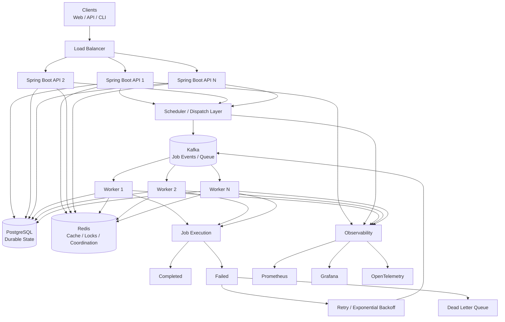

# Chronos Architecture

## High-Level Architecture



## Ownership

| Component | Primary responsibility |
|---|---|
| Spring Boot API | Job management and API orchestration |
| Scheduler | Determine when jobs become eligible |
| PostgreSQL | Durable job and execution state |
| Redis | Cache, locks, coordination, ephemeral state |
| Kafka | Asynchronous event transport |
| Workers | Execute jobs concurrently |
| DLQ | Isolate jobs that exhaust retry policy |
| Observability | Metrics, logs, traces, health |

## Important execution rule

The architecture should not assume that a job is delivered exactly once.

Instead:

```text
Delivery
   ↓
Claim / Idempotency Check
   ↓
Execute
   ↓
Persist Result
   ↓
Publish Outcome
```

This makes duplicate delivery a normal failure mode to be handled explicitly.
